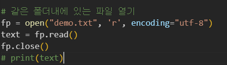
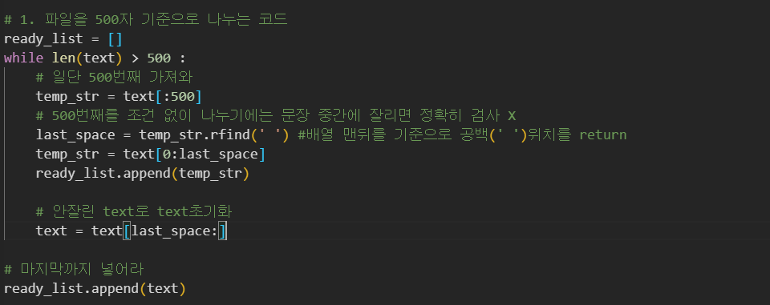
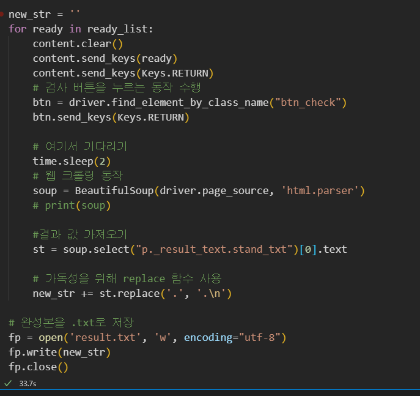
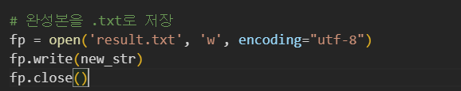
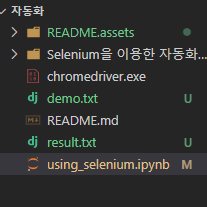

# Selenium을 이용한 자동화 코딩하기 

>  오랜만에 코딩자료로 돌아왔습니당 ㅎㅎ 
>
> 정리에 앞서 README내용이 [코딩하는 거니 - 파이썬으로 한글 만춤법 검사 자동화 코딩하기](https://www.youtube.com/watch?v=afv7vsgweBE)를 참고 하여 작성 되었음을 알립니다.

사용된 라이브러리 : 웹 자동화 /  `selenium` , 웹 크롤링 / `Beautiful soup`, 시간딜레이 / `time`,  디렉토리 내의 파일 접근 / `open, read, close, write`

## 0. 개발 환경 설정 

저는 vs를 이용하여 개발환경을 만들었습니다. 

거니님은 `jupyter notebook`을 이용하셨지만 저는 vs코드에 jupyter notebook이 설치되어 있어서 진행 했습니다. 

### 1. 먼저 `pip install selenium`을 진행해 줍니다.

vs코드의 경우 터미널을 여셔서 설치 해 줍니다. 


잘 설치 되었는지 확인하고 싶으시다면 `pip list`로 확인이 가능합니다.


설치가 잘 되어있음을 알 수 있습니다. 


여기서 저는 바로 vs코드를 실행 시켰는데요 그러면 에러 페이지가 뜹니다.


이런 에러 페이지가 뜨는걸 확인 할 수 있는데요, 바로 구글링을 통해 드라이버가 설치되지 않았음을 확인 할 수 있어 저의 개발 환경에 맞는 운영체제를 선택해 chrome 드라이버를 설치해 같은 폴더 안에 넣어줬습니다. 

### 2. 크롬 드라이버 설치하기 

#### 1) 크롬 버전을 확인합니다. 


왼쪽 상단에 `chrome 정보`를 클릭하여 크롬 버전을 확인합니다. 


위의 버전에 맞는 크롬 드라이버를 다운로드합니다. 

#### 링크 : https://chromedriver.chromium.org/downloads


#### 2) 버전에 맞는 드라이버 선택 


자신의 개발 환경에 맞는 운영체제를 선택해 드라이버를 설치합니다.


#### 3) 압축파일을 풀어 `드라이버.exe`파일을 실행파일과 같은 폴더에 넣습니다. 


그러면 에러가 뜨지 않고 driver 라는 객체가 실행이 되면서 `chrome이 자동화된 테스트 소프트웨어에 의해 제어되고 있습니다.` 라는 표시와 함께 `chrome창`이 열리게 됩니다.


## 2. 자동화로 열었던 페이지에서 하고 싶은 동작을 명령어로 입력해야합니다.

참고 자료 : https://selenium-python.readthedocs.io/getting-started.html#simple-usage

공식문서를 확인해 보면 element를 어떻게 가지고 오는지에 대해 명시해 놓았습니다. 

따라서 공식 문서에서 처럼 우리가 원하는 element를 가져와 보겠습니다.


공식문서에서 보시면 `key`는 `키보드를 사용하여 입력하는 것과 유사합니다.` 라고 말하고 있습니다.

따라서 `selenium.webdriver.common.keys`에서 가져온 `Keys클래스`를 사용하여 특수 키를 보낼 수 있습니다. 


이해를 돕고자 쉽게  설명하자면 

```python 
elem.clear() # 안전을 위해 먼저 입력 필드에서 미리 채워진 텍스트를 지워 검색 결과에 영향을 미치지 않도록 합니다.
elem.sends_keys("검색할 단어") # 괄호안에 검색할 단어를 넣고 
elem.sends_keys(Keys.RETURN) # 엔터를 누르라는 명령어
```

위와 같이 해석할 수 있습니다 . 


직접 구현을 해보면 


이렇게 작성 할 수 있고 코드를 실행 시키면 


이렇게 BTS가 검색된것을 확인할 수 있습니다. 


저희는 `맞춤법 검사기`를 이용하기 위함이니까 검색단어에 해당 단어를 적어 주겠습니다. 


저희는 맞춤법 검사기를 이용하기 위해 `원문`이라는 곳에 글을 작성해야 합니다.

앞에서 `검색창`을 가져온 것처럼 이젠 원문을 가져오도록 하겠습니다. 


### 1) 가져올 요소를 찾는 방법

`F12`를 누르던지 `마우스 오른쪽 버튼 -> 검사`를 누르던지 아래와 같은 창이 나오도록 만들어 주시고 `Elements` 로 해당 요소의 이름을 확인합니다. 


저희가 사용하려는 요소는 `textarea`태그에 `class = 'txt_gray'`입니다. 

아까는 `name`으로 요소를 가져왔다면 지금은 `class_name`으로 가져와야합니다. 


코드를 작성해 보겠습니다.


해당 코드를 실행한 결과입니다. 


이때 우리는 `검사하기` 버튼을 눌러야 비로소 검사하기를 진행 할 수 있습니다.

따라서 `검사하기` 요소를 가져와 누르는 작업을 수행하는 코드를 작성해야 합니다. 


위와 마찬가지로 요소를 지정하는 class이름을 가지고 와서 해당 작업을 수행하는 코드를 작성 시켜 주면 아래와 같은 결과가 나오게 됩니다.


****

둘은 같은 동작을 수행하는 코드입니다.

`btn.send_keys(Keys.RETURN) == btn.click()` 


여기서 `selenium`은 할 일을 다했습니다.

`seleninum`은 웹페이지를 이동하면서 액션을 취하는 것을 도와주는 라이브러리이기 때문입니다.


따라서 웹페이지에서 원하는 정보만 가져오기 위해서는 다른 라이브러리(현재 화면의 코드를 분석해서 원하는 부분만 가져오는 라이브러리)를 사용해야 합니다. 

(검색창에 python crawiling library라고 치면 다양한 라이브러리를 볼 수 있지만 저는 beautilful soup 라이브러리를 이용하겠습니다.)


#### 여기서 문제점이 있습니다. 검색엔진 렌더링 속도차로 검색 결과가 아닌 default 값을 가져와버립니다.


이렇게요...

제가 가지고 오고 싶은건 검사 후 결과인데 네이버에서 `default`로 지정한 값을 가져와 버립니다.


따라서 `import time`을 통해 `js`처럼 시간을 늦춰 검사 결과 값을 가져오도록 하는데 여기서 중요한건 `어디서 시간을 멈추냐` 입니다.

저는 이렇게 이미 요소를 가져온 다음에 기다린거라 계속 결과가 원하는 결과가 나오지 않았습니다.


요소를 너무 빨리 가져오지 않아야 하기 때문에 기다리는 코드는 크롤링 전에 기다리고 가져와야 합니다.


이렇게 해야 검사 결과를 바르게 뽑아낼 수 있습니다. 

검사 결과가 리스트이므로 `인덱스 = 0`에 접근해 사람이 읽을 수 있는 글만 뽑아 와라 `text`는 함수를 이용합니다.  


※ select에 관련된 문법은 아래에 명시해 두겠습니다.

```python
soup.select('원하는 정보')  # select('원하는 정보') -->  단 하나만 있더라도, 복수 가능한 형태로 되어있음

soup.select('태그명')
soup.select('.클래스명')
soup.select('상위태그명 > 하위태그명 > 하위태그명')
soup.select('상위태그명.클래스명 > 하위태그명.클래스명')    # 바로 아래의(자식) 태그를 선택시에는 > 기호를 사용
soup.select('상위태그명.클래스명 하~위태그명')              # 아래의(자손) 태그를 선택시에는   띄어쓰기 사용
soup.select('상위태그명 > 바로아래태그명 하~위태그명')     
soup.select('.클래스명')
soup.select('#아이디명')                  # 태그는 여러개에 사용 가능하나 아이디는 한번만 사용 가능함! ==> 선택하기 좋음
soup.select('태그명.클래스명)
soup.select('#아이디명 > 태그명.클래스명)
soup.select('태그명[속성1=값1]')
```

출처 : https://m.blog.naver.com/kiddwannabe/221177292446


### 2) 네이버 맞춤법 검사 기준 최대 500자인데 어떻게 끊어서 맞춤법 검사를 할 수 있을까요?

> 여기서 알고리즘 역량이 요구됩니다. 
>
> 위에서는 짧은 문장 하나가 제대로 동작하는 것을 확인했다면 우리가 사용하기에 편리한 단위로 프로그램을 동작시켜야합니다. 

데모파일은 [저작권만료 사이트](https://gongu.copyright.or.kr/gongu/main/main.do)에서 가져왔습니다

해당 파일을 제 마음대로 오타나 띄어쓰기를 넣어서 문제가 있는 텍스트로 만들었습니다.

해당 텍스트 파일을 검사기에 검사하기 위해 최대 500자 안으로 나눠서 텍스트가 끝날때 까지 돌릴계획입니다. 


#### 1. 디렉토리 내의 파일 열기 

```python
# 같은 폴더내에 있는 파일 열기 
fp = open("demo.txt", 'r', encoding="utf-8")
text = fp.read()
fp.close()
# print(text)
```




해당 파일을 열어서 확인하는 코드입니다.

`printf(text)`를 실행시키면 잘 열리는 것을 확인 할 수 있습니다. 


#### 2. 해당 파일을 최대 500자 기준으로 나누는 알고리즘 

```python
# 1. 파일을 500자 기준으로 나누는 코드
ready_list = []
while len(text) > 500 : 
    # 일단 500번째 가져와 
    temp_str = text[:500]
    # 500번째를 조건 없이 나누기에는 문장 중간에 잘리면 정확히 검사 X
    last_space = temp_str.rfind(' ') #배열 맨뒤를 기준으로 공백(' ')위치를 return 
    temp_str = text[0:last_space]
    ready_list.append(temp_str)

    # 안잘린 text로 text초기화 
    text = text[last_space:]

# 마지막까지 넣어라 
ready_list.append(text)
```




#### 3. 나눠 놓은 단위대로 맞춤범 검사기를 돌린다.

```python
new_str = ''
for ready in ready_list:
    content.clear()
    content.send_keys(ready)
    content.send_keys(Keys.RETURN)
    # 검사 버튼을 누르는 동작 수행 
    btn = driver.find_element_by_class_name("btn_check")
    btn.send_keys(Keys.RETURN)

    # 여기서 기다리기
    time.sleep(2)
    # 웹 크롤링 동작
    soup = BeautifulSoup(driver.page_source, 'html.parser')
    # print(soup)

    #결과 값 가져오기
    st = soup.select("p._result_text.stand_txt")[0].text
    
    # 가독성을 위해 replace 함수 사용 
    new_str += st.replace('.', '.\n')
```





#### 4. 완성된 str을 파일로 저장하기 

```python
# 완성본을 .txt로 저장 
fp = open('result.txt', 'w', encoding="utf-8")
fp.write(new_str)
fp.close()
```




#### 5. 결과 확인




`result.txt`파일이 잘 만들어진 것을 확인할 수 있습니다. 


## 느낀점 

일단 파이썬을 이용한 코딩이 가장 실용적이라는 것을 한 번 더 깨닫습니다.😀😀

물론 다양한 언어들의 장점이 있지만 파이썬은 특히나 간편하면서도 일상생활을 편리하게 해준다는 것에 있어 더 가치 있는 것 같습니다.

파이썬 프로그래밍이 이런 면에 있어서는 굉장히 간편하고 유용하다는 사실과 1년 전만 해도 이렇게 응용할 수 있는 라이브러리가 없었던 것 같은데 (혹은 제가 발견하지 못한것 일 수도 있는 것 같습니다..ㅎㅎ..) 이렇게나 유용하게 응용이 가능하다니 신기하기도 합니다.


그리고 알고리즘 역량이 여기서 발휘 되어야 한다는 사실에 살짝 놀랐습니다. 

역시 사람은 응용할 수 있는 사람이 되어야 한다는 것을 깨달았습니다 ㅎㅎ 

아무튼 오늘 하루 짧은 시간 의미 있는 코딩을 진행해 봤습니다! 

기회가 된다면 또 업로드 하겠습니다! 😄😘

